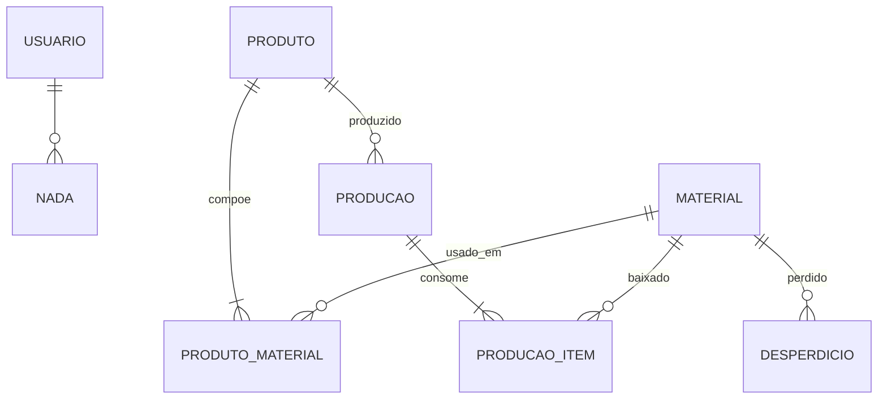

# PrintFlow — Modelo de Dados

Convenções: tabelas e colunas em `snake_case` português. Dinheiro `NUMERIC(12,2)`, quantidades `NUMERIC(12,3)`. Todas as tabelas têm `id` (PK, serial/identity), `criado_em` e `atualizado_em` (timestamps automáticos).

## Sistema de Unidades de Medida (decisão D5)

Problema do documento original: unidades compostas (pacote, caixa, rolo) "podem ser convertidas" mas sem fator definido. Solução:

- **`unidade_compra`**: como o material é comprado/cadastrado (ex: `pacote`).
- **`unidade_base`**: unidade em que o estoque é armazenado e consumido (ex: `folha`).
- **`fator_conversao`**: quantas unidades base há em 1 unidade de compra (ex: 100). Para unidades simples, `unidade_base = unidade_compra` e fator = 1.

Enum `UnidadeMedida` (valores possíveis para ambas as colunas):

```
un, folha, pacote, ml, l, g, kg, cm, m, cm2, m2, cx, rolo
```

Regras de consistência (validar no service):
1. Se `unidade_compra == unidade_base` → `fator_conversao = 1` (forçar).
2. Combinações válidas para unidades compostas: `pacote→{un, folha}`, `cx→{un, folha}`, `rolo→{m, cm, m2, cm2}`, `kg→g`, `l→ml`, `m→cm`, `m2→cm2`.
3. `quantidade_atual`, `quantidade_minima` e todo consumo (produção/desperdício) são SEMPRE em `unidade_base`.
4. `custo_unitario_base = valor_compra / fator_conversao` — recalculado automaticamente ao salvar (nunca informado direto pelo usuário).
5. A UI de cadastro mostra o preview: "1 pacote de R$ 25,00 com 100 folhas → R$ 0,25/folha".

## Tabelas

### usuario
| Coluna | Tipo | Regras |
|---|---|---|
| nome | VARCHAR(120) | obrigatório |
| email | VARCHAR(255) UNIQUE | obrigatório, validado |
| senha_hash | VARCHAR(255) | bcrypt |

Máximo 1 registro (validação de aplicação no setup).

### material
| Coluna | Tipo | Regras |
|---|---|---|
| nome | VARCHAR(120) | obrigatório, único entre ativos |
| unidade_compra | ENUM UnidadeMedida | obrigatório |
| unidade_base | ENUM UnidadeMedida | obrigatório |
| fator_conversao | NUMERIC(12,3) | > 0, default 1 |
| valor_compra | NUMERIC(12,2) | ≥ 0; preço de 1 unidade_compra |
| custo_unitario_base | NUMERIC(12,4) | calculado: valor_compra / fator_conversao |
| quantidade_atual | NUMERIC(12,3) | ≥ 0, em unidade_base |
| quantidade_minima | NUMERIC(12,3) | ≥ 0, em unidade_base |
| ativo | BOOLEAN | default true |

Propriedade derivada na API: `estoque_baixo = quantidade_atual < quantidade_minima`.

### produto
| Coluna | Tipo | Regras |
|---|---|---|
| nome | VARCHAR(120) | obrigatório, único entre ativos |
| preco_venda | NUMERIC(12,2) | ≥ 0 |
| ativo | BOOLEAN | default true |

Derivados na API (calculados a partir da composição, não persistidos — sempre refletem o custo ATUAL dos materiais):
- `custo_producao = Σ (pm.quantidade_utilizada × material.custo_unitario_base)`
- `lucro_estimado = preco_venda − custo_producao`

### produto_material (composição / BOM)
| Coluna | Tipo | Regras |
|---|---|---|
| produto_id | FK → produto | |
| material_id | FK → material | |
| quantidade_utilizada | NUMERIC(12,3) | > 0, em unidade_base do material |

Constraint: UNIQUE(produto_id, material_id). Produto deve ter ≥ 1 item (RN05).

### producao
| Coluna | Tipo | Regras |
|---|---|---|
| produto_id | FK → produto | |
| quantidade_produzida | NUMERIC(12,3) | > 0 (inteiro na prática, mas manter numeric) |
| data_producao | DATE | default hoje, editável |
| custo_total | NUMERIC(12,2) | SNAPSHOT: custo_producao do produto no momento × quantidade |
| valor_total | NUMERIC(12,2) | SNAPSHOT: preco_venda × quantidade |
| lucro_total | NUMERIC(12,2) | valor_total − custo_total |

### producao_item (snapshot detalhado da baixa — necessário para relatórios de consumo)
| Coluna | Tipo | Regras |
|---|---|---|
| producao_id | FK → producao | |
| material_id | FK → material | |
| quantidade_consumida | NUMERIC(12,3) | em unidade_base |
| custo_unitario_snapshot | NUMERIC(12,4) | custo do material no momento |
| custo_total_item | NUMERIC(12,2) | quantidade × custo_unitario_snapshot |

### desperdicio
| Coluna | Tipo | Regras |
|---|---|---|
| material_id | FK → material | |
| quantidade_perdida | NUMERIC(12,3) | > 0 e ≤ quantidade_atual do material, em unidade_base |
| motivo | VARCHAR(255) | obrigatório |
| data | DATE | default hoje |
| custo_perda | NUMERIC(12,2) | SNAPSHOT: quantidade × custo_unitario_base |

## Diagrama (Mermaid)



(Ignorar a linha USUARIO — entidade isolada, sem relacionamentos.)

## Fluxo transacional do registro de produção (RF15–RF17, RN08–RN09)

1. Carregar produto ativo com composição (≥1 item; 422 se produto inativo ou sem composição).
2. Para cada item da composição: `necessario = quantidade_utilizada × quantidade_produzida`.
3. Validar TODOS: se algum `material.quantidade_atual < necessario`, abortar com 422 e payload:
   ```json
   {"detail": "Estoque insuficiente", "materiais": [{"material": "Papel A4", "necessario": 500, "disponivel": 320, "faltante": 180, "unidade": "folha"}]}
   ```
4. Se todos ok, na mesma transação (com lock `SELECT ... FOR UPDATE` nos materiais):
   - baixar estoque de cada material;
   - criar `producao` com snapshots;
   - criar um `producao_item` por material.
5. Commit. Retornar produção criada com itens e alertas de estoque baixo resultantes.
